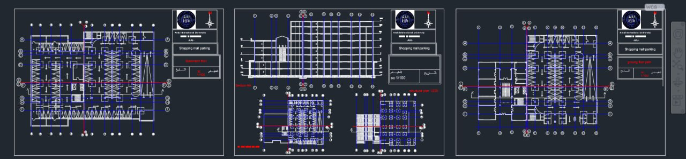
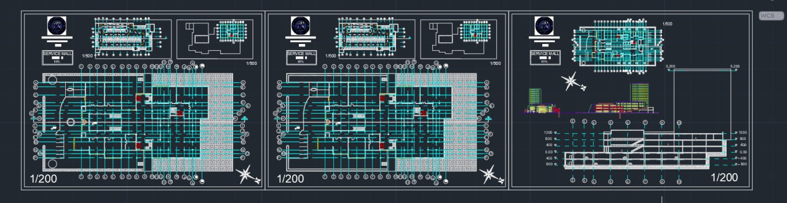
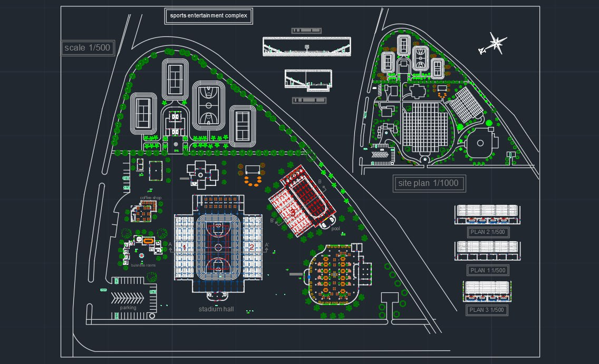

# 🏛️ AutoCAD Architecture Portfolio – Arab International University
#  Abdulrahman Jedeni

This repository contains a collection of my AutoCAD projects developed during my architectural studies at **Arab International University** as part of Executive Design and Architectural Design courses. Projects include commercial, service, and sports-oriented multi-use developments with full executive plans, sections, facades, and detailing.

---

## 📂 Project Overview

### 🛍️ [Shopping Mall Project](./shopping-mall)
**Executive Design Course**  
**2024–2025 Academic Year**

- Multi-use commercial and parking building
- Includes 3 commercial floors and a 5-floor parking structure
- Focused on executive architectural plans: projections, passages, facades, site layout, and construction details
- Emphasis on functional zoning, movement, and construction methodology

**Preview:**

---

### 🏢 [Service Center Project](./service-center)
**Architectural Design 6 – AD6**  
**2024 First Semester**

- A mixed-use service mall adjacent to the Palace of Justice in Damascus
- Includes commercial spaces, administrative offices, and warehouse/showroom facilities
- Site covers 7,000 m² with contextual integration, respecting cultural and urban fabric
- Design responds to complex site conditions, historical significance, and movement networks

**Preview:**

---

### 🏟️ [Sports Complex Project](./sports-complex)
**Architectural Design 7 – AD7**  
**2024–2025 Second Semester**

- Sports and recreation complex for Damascus University students
- Built on 90,000 m² site near Mezzeh university housing
- Green, environmentally integrated design with gymnasiums, multipurpose courts, fitness and wellness facilities
- Focus on user experience, accessibility, daylight, and cross-ventilation

**Preview:**

---

## 📐 Skills Demonstrated

- AutoCAD (2D & 3D architectural drafting)
- Executive detailing and annotation
- Spatial programming and circulation design
- Site analysis and contextual response
- Graphic communication and plan presentation

---

## 🏛 Institution

**Arab International University – Faculty of Architecture**  
Academic Years: 2024–2025

